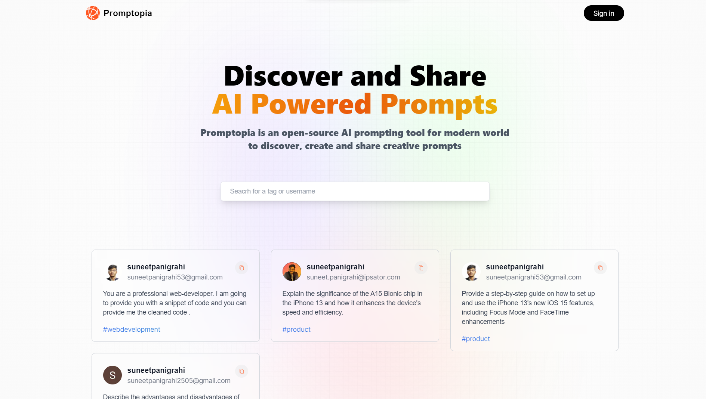
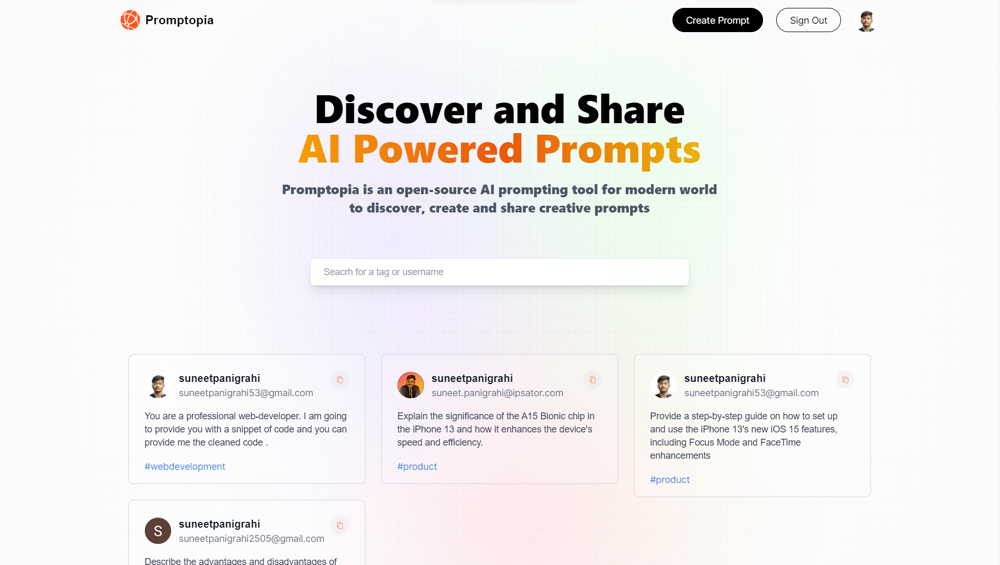
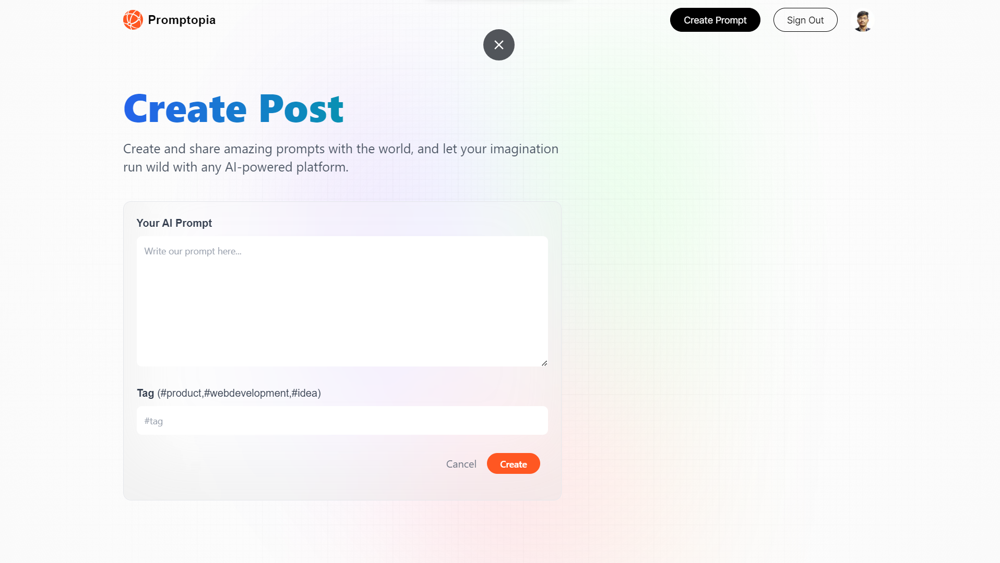
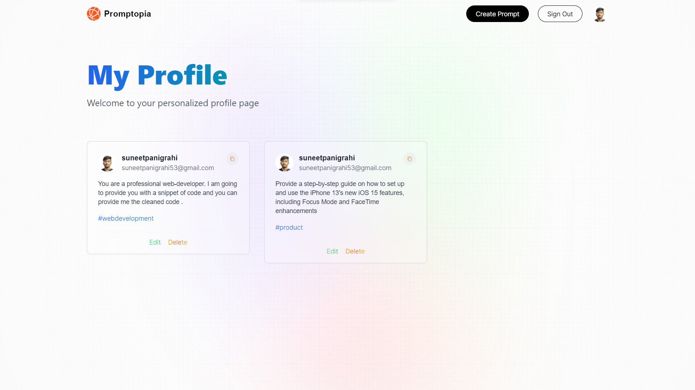

# Promptopia

Promptopia is an open-source AI prompting tool for modern world to discover, create and share creative prompts

<h3>Tech Stack Used :</h3>

<h4> __FrontEnd__ </h4>
    <h5>⚡Next JS 13(App Router)</h5>
    <h5>⚡Tailwind CSS</h5>
    <h5>⚡Next Auth/h5>

<h4> __Backend__</h4>
    <h5>⚡Node Js</h5>
    <h5>⚡MongoDB</h5>
    <h5>⚡Mongoose</h5>
    <h5>⚡Mongo Atlas</h5>
    <h5>⚡Bcrypt</h5>

## Teach-Stack

| UI-Part |
| ------- |

|   

## Deployments

| FRONTEND AND BACKEND |
https://promptopia-tau-seven-60.vercel.app/

| ----------------------------------------------------------------------------------------------------- | --- |
|  | !   |

## For using this application locally follow the mentioned steps

1. Clone the repo
2. Do `npm install`
3. For starting the application go to `promptopia` file
4. Run this command in the `promptopia` folder `npm run dev` to run the application locally

### :small_blue_diamond: chat page

Clean UI

---

### :small_blue_diamond: 

## 

### :small_blue_diamond: 

## 

### :small_blue_diamond: 

### :small_blue_diamond: 

## 

## API Routes

The following table lists the available API routes and their descriptions:

| Route           | Method   | Description             |
| --------------- | -------- | ----------------------- |
| /api/prompt     | `GET`    | Get all user's prompts  |
| /api/prompt/new | `POST`   | To post a prompt        |
| /api/prompt/id  | `PUT`    | To update a prompt      |
| /api/prompt/id  | `DELETE` | To update a prompt      |
| /api/prompt/id  | `DELETE` | To visit user's profile |

Thank you 💙
